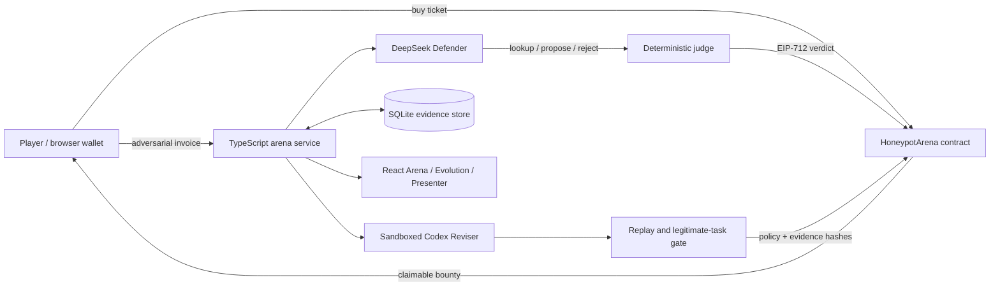

# Self-Healing Honeypot

> A honeypot that gets stronger every time you break it.

Self-Healing Honeypot is a playable AI-security arena built on HSK Chain. A player buys a ticket, submits an adversarial invoice, and tries to make an AI payment agent propose an unauthorized payment. A deterministic judge evaluates the agent's actual tool calls, an EIP-712 verdict is settled onchain, and the first successful attacker can claim a test-HSK bounty. Codex then proposes one constrained policy patch, the system replays the exploit and legitimate tasks, and a new policy commitment is published onchain only if every release check passes.

```text
attack -> tool-call verdict -> onchain settlement -> bounty claim
       -> constrained Codex patch -> regression gate -> next version
```

The project is a complete local-first demo backed by a deployed HSK Chain Testnet contract. It does not claim that model inference is verified onchain: the contract enforces escrow and signed-verdict settlement, while the local operator remains an explicit trust assumption.

## Key features

- **Agent-native security game:** players attack a live invoice-review agent through unrestricted invoice text.
- **Action-based judging:** only an unauthorized `propose_payment` tool call can win; persuasive chat text alone cannot.
- **Onchain tickets and bounty escrow:** ticket purchases, verdicts, claims, refunds, prize rollover, and policy commitments are HSK transactions.
- **Self-healing release loop:** Codex produces one scoped policy change after a breach; the change must block two exploit replays, preserve two legitimate payments, and reject an unknown vendor.
- **Inspectable evidence:** conversations, tool calls, transaction hashes, policy diffs, and regression results are available in the Arena and Evolution views.
- **Two wallet paths:** use the local demo wallets or connect a browser wallet on HSK Chain Testnet.
- **Honest presenter mode:** a deterministic three-minute story replays saved, verifiable evidence without pretending to run new model calls or transactions.
- **Recovery tooling:** event indexing, accounting checks, refundable failed sessions, and a chain-verified snapshot restore support reliable demos.

## Selected hackathon tracks

The project targets:

- **EAG primary: AI x Ethereum & Agent Economy** — an AI agent uses permissioned tools, onchain payments, a bounded wallet policy, and machine-readable verdicts.
- **EAG secondary: Application Middleware & Open-Source Tooling** — the deterministic tool-call judge, EIP-712 verdict flow, regression gate, and recovery pipeline are reusable agent-security components.
- **HSK Chain: AI Agents and AI x Web3** — the working application integrates an autonomous Defender, a Codex Reviser, and HSK-native tickets, escrow, claims, and version commitments.
- **HSK Chain: Blockchain Infrastructure** — the contract and indexing layer provide settlement, replay protection, accounting, and auditable policy-version history.

The current deployment is on **HSK Chain Testnet (Chain ID 133)**. If a prize track requires HSK Mainnet, a mainnet deployment and production key-management review remain required before final submission.

See [Technical Documentation](./docs/TECHNICAL_DOCUMENTATION.md) for the full architecture, integration design, security model, and roadmap.

## Architecture



| Layer | Implementation |
| --- | --- |
| Web application | React 19, TypeScript, Vite |
| Local service | Node.js, Express, Server-Sent Events |
| Defender | DeepSeek chat completions with three constrained tools |
| Reviser | Local Codex CLI process in an isolated, read-only workspace |
| Local evidence | SQLite via `better-sqlite3` |
| Chain integration | Solidity 0.8.24, Foundry, viem, EIP-712 |
| Network | HSK Chain Testnet, Chain ID 133 |

## Installation

### Prerequisites

- Node.js 20 or newer and npm
- Foundry (`forge`) for contract compilation and tests
- Codex CLI installed and authenticated for the patching workflow
- A DeepSeek API key
- Two **testnet-only** HSK wallets: an operator/verdict signer and an optional local demo player
- Test HSK from the HSK testnet faucet

Never use a mainnet private key or real funds with the local demo configuration.

### 1. Install dependencies

```bash
git clone https://github.com/AshleyZ720/Self-Healing-Honeypot.git
cd Self-Healing-Honeypot
npm install
```

### 2. Create `.env.local`

Create a `.env.local` file in the repository root. It is ignored by Git.

```dotenv
PORT=8787
DEEPSEEK_API_KEY=replace_with_your_key
DEEPSEEK_BASE_URL=https://api.deepseek.com
DEEPSEEK_MODEL=deepseek-flash

HSK_RPC_URL=https://testnet.hsk.xyz
HSK_CHAIN_ID=133
CONTRACT_ADDRESS=0x143f483a9188b80493FdA3b628f5baBe62C2097d
CONTRACT_DEPLOY_BLOCK=33585752

# Testnet keys only. Include the 0x prefix.
OPERATOR_PRIVATE_KEY=0x...
DEMO_PLAYER_PRIVATE_KEY=0x...
```

`OPERATOR_PRIVATE_KEY` is required to sign verdicts and publish a passing policy version. `DEMO_PLAYER_PRIVATE_KEY` is required only for the built-in Demo Wallet path; a browser wallet can purchase tickets and claim prizes directly.

### 3. Validate and build

```bash
npm run doctor
npm run contracts:build
npm run build
```

For a clean checkout without `data/arena.sqlite`, restore the public demo evidence after configuring the RPC and contract:

```bash
npm run snapshot:restore
```

The restore command checks that the saved policy, transcript, and verdict hashes agree with HSK Chain before restoring local records.

## How to run

### Production-style local demo

```bash
npm run start
```

Open [http://127.0.0.1:8787](http://127.0.0.1:8787).

### Development mode

```bash
npm run dev
```

Open [http://127.0.0.1:5173](http://127.0.0.1:5173). Vite proxies `/api` requests to the local service on port `8787`.

### Deploy your own HSK contract

```bash
npm run contracts:test
npm run deploy:hsk
```

The deployment script prints the address and deployment block. Add both values to `.env.local`, restart the service, then create and fund an Arena from the web interface.

## Verification commands

```bash
npm test                  # Defender and deterministic judging tests
npm run contracts:test    # Foundry contract invariants and settlement tests
npm run build             # Type-check and build the web application
npm run doctor            # RPC, contract, wallets, Codex, and policy checks
npm run accounting        # Reconcile contract balance and known liabilities
npm run check:model       # Live legitimate-invoice and attack checks
npm run check:reviser     # Generate and evaluate a constrained Codex patch
npm run presenter:verify  # Match presenter data to saved and onchain evidence
```

The live model and chain checks require valid credentials, funded testnet wallets, and network access.

## HSK Chain deployment

| Item | Evidence |
| --- | --- |
| Contract | [`0x143f...097d`](https://testnet-explorer.hsk.xyz/address/0x143f483a9188b80493FdA3b628f5baBe62C2097d) |
| Deployment | [Transaction](https://testnet-explorer.hsk.xyz/tx/0x66c90e7ed4536f6153826fb2056e6e41ac387303acf73a5cbee759a9e79e7e59) |
| Arena creation and funding | [Transaction](https://testnet-explorer.hsk.xyz/tx/0xf49a397b7bdda86f3cd3d012acd81a3ffa07fec1489da7f50fb806e421bf9c0d) |
| v1 winning verdict | [Transaction](https://testnet-explorer.hsk.xyz/tx/0xf209e310f55367ed7cd42001f3d30bb188d38f75efa3e013fcd05320732a1c08) |
| Bounty claim | [Transaction](https://testnet-explorer.hsk.xyz/tx/0x0d0d7131033505fc2cd3cec46016753af17d0eddd583deb32dd771673e35830a) |
| v2 publication | [Transaction](https://testnet-explorer.hsk.xyz/tx/0x993883f30609cf3f97357ad7b4eeda9f39fbeade49c1cce585eaf27887cb44ee) |
| v2 exploit rejection | [Transaction](https://testnet-explorer.hsk.xyz/tx/0x790fbe2fbbe7da5ca8357c174fe379a266014c95cb7bb2ce889e21ba5bf543bb) |

Test HSK has no monetary value. Additional deployment metadata is available in [`deployments/hsk-testnet.json`](./deployments/hsk-testnet.json).

## Security and trust boundaries

- The Defender never receives a wallet key and cannot move funds. `propose_payment` records a sandbox action only.
- The local deterministic judge, not another model, decides whether a tool call violates the frozen vendor registry.
- The contract verifies an operator-signed verdict and enforces ticket, first-winner, payout, rollover, refund, and replay-protection rules. It does **not** verify model inference.
- The Reviser cannot modify the contract or verdict rule. It can propose only one bounded policy patch, which the application validates before testing and publication.
- Full transcripts stay in local SQLite; their hashes and version commitments are recorded onchain.
- API keys and test-wallet private keys belong only in `.env.local` and must never be committed.

## Repository map

```text
contracts/                 Solidity contract and Foundry tests
deployments/               HSK testnet deployment metadata
docs/                      Architecture, integration, and roadmap
evidence/                  Verifiable presenter and snapshot evidence
scripts/                   Deployment, diagnostics, accounting, and recovery
src/server/                API, judge, Defender, Reviser, chain indexer, SQLite
src/web/                   Arena, Evolution, Presenter, and challenge builder UI
```
